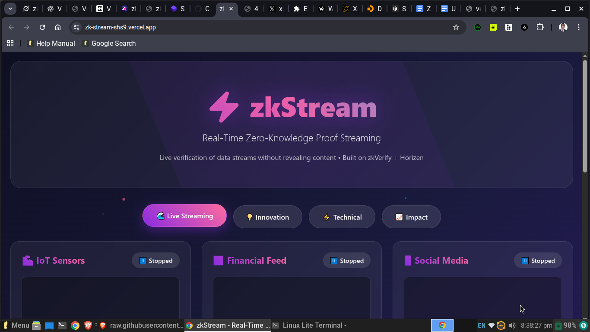

---

# 🎬 ZkStream – Use Case Storyboard

### 1. **The Problem**

* In today’s digital world, **data streams are everywhere**: live video, IoT sensors, financial market feeds, medical monitors.
* But once streamed, **how can anyone prove the integrity** of what was broadcast without storing gigabytes of raw data?
* Regulators, auditors, and users need **verifiable guarantees** that the stream wasn’t tampered with.

---

### 2. **The Solution – ZkStream**

* ZkStream lets users **start a live stream**, automatically hashing each frame or data chunk in real-time.
* These hashes are bundled into a **cryptographic commitment**.
* The commitment is sent to **zkVerify/Horizen**, producing a **zero-knowledge proof** that:

  * ✅ The stream happened at a specific time.
  * ✅ The stream data was not altered.
  * ✅ The proof can be verified publicly *without revealing the full stream*.

---

### 3. **How it Works (Storyboard Flow)**

📌 **Step 1 – Streaming Starts**

* A journalist begins streaming a live protest.
* ZkStream hashes the video frames locally.

📌 **Step 2 – Commitments Created**

* Hashes are chained (Poseidon/Merkle) → final root is generated.

📌 **Step 3 – Proof on zkVerify**

* The root is submitted to zkVerify, where a **ZKP proof** is generated.
* Verifiers don’t need the video, just the proof + verification key.

📌 **Step 4 – Immutable Proof**

* Regulators, platforms, or courts can later **verify authenticity** with one click.
* No need to store the raw 10GB stream, just the lightweight proof.

---

### 4. **Use Case Scenarios**

1. **Media Rights & Journalism** – Verifiable proof that a livestream was authentic, not deepfaked or tampered.
2. **IoT / Industry Compliance** – Proof that sensor readings (e.g., emissions, temperature logs) were faithfully recorded.
3. **Financial Streaming Data** – Guarantee that market feeds were unaltered during audits or disputes.
4. **Medical Devices** – Prove that continuous patient monitoring streams were not tampered with.

---

### 5. **Why zkVerify + Horizen?**

* zkVerify provides a **scalable, public verification layer**.
* Anyone can validate proofs without needing access to private data.
* Horizen ensures interoperability + trust for real-world compliance scenarios.

---

### 📊 **Impact Highlights (to show judges)**

* **Innovation** – New primitive: verifiable proof-of-stream.
* **Relevance** – Built on zkVerify/Horizen for real-world trust.
* **Technical Depth** – Proof generation, commitments, blockchain integration.
* **Polish** – Hosted demo, clean README, screenshots, upcoming video pitch.

---

⚡ You can even visualize this as a **diagram**:

```
[ Live Stream ] → [ Hashing Engine ] → [ Commitment Root ] 
                  → [ zkVerify Proof ] → [ Public Verifiers ]
```

---


