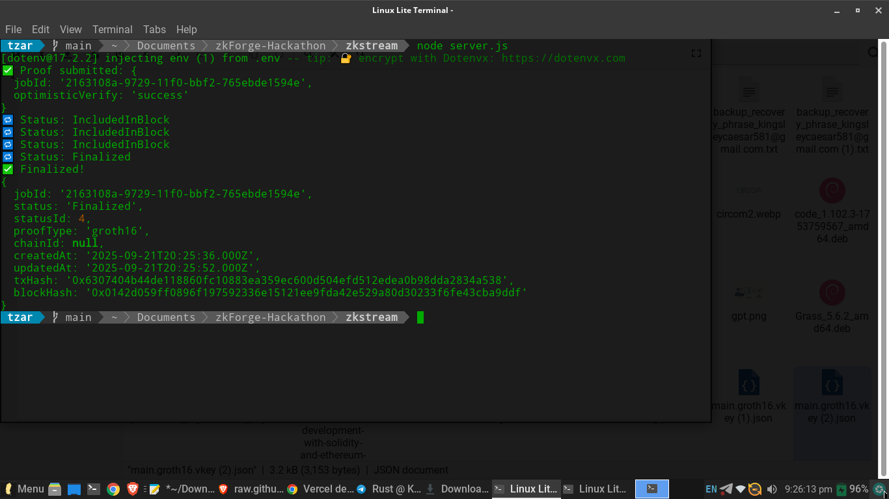

# 🔐 ZkStream – Verifiable Proof-of-Streaming

**ZkStream** is a zero-knowledge proof-of-streaming protocol that proves live data (video, IoT, finance) is **authentic and untampered**, using **zkVerify/Horizen** for lightweight, public verification.


👉 [Live Demo](https://zk-stream-shs9.vercel.app/)

---

## 📖 Description

ZkStream introduces a new primitive: **verifiable proof-of-stream**.
By hashing frames or data chunks in real-time and submitting commitments to zkVerify, ZkStream makes it possible to:

* Prove that a stream happened at a specific time
* Guarantee the stream was not altered
* Verify authenticity *without storing or revealing the full raw stream*

---

## 🎬 Use Case Storyboard

### 1. **The Problem**

* Data streams (video, IoT, finance, medical) are everywhere.
* Once streamed, how can anyone prove they were authentic without storing GBs of raw data?

### 2. **The Solution – ZkStream**

* Hashes stream frames/data chunks → generates commitments → submits to zkVerify.
* Creates **lightweight, verifiable proofs** that anyone can check publicly.

### 3. **How it Works**

```
[ Live Stream ] → [ Hashing Engine ] → [ Commitment Root ] 
                  → [ zkVerify Proof ] → [ Public Verifiers ]
```

### 4. **Use Cases**

* **Journalism** – prove livestream authenticity against deepfakes.
* **IoT Compliance** – verify sensor logs (emissions, temperature, etc.).
* **Finance** – guarantee tamper-proof market feeds.
* **Healthcare** – prove continuous patient monitoring data is authentic.

### 5. **Why zkVerify + Horizen?**

* Provides a **scalable public verification layer**.
* Enables **compliance-ready zero-knowledge proofs** of streaming integrity.

---

## 🖼️ Screenshots


*Figure: ZkStream frontend demo (start/stop streaming + hash generation)*


---

## 🏗️ Architecture Diagram

```text
 ┌──────────────┐      ┌──────────────┐      ┌──────────────┐
 │   Streamer   │ ---> │ Hash Engine  │ ---> │ Commitment   │
 │  (Video/IoT) │      │ (Poseidon)   │      │   Root       │
 └──────────────┘      └──────────────┘      └─────┬────────┘
                                                    │
                                                    ▼
                                          ┌─────────────────────┐
                                          │ zkVerify Relayer API │
                                          └───────┬─────────────┘
                                                  │
                                                  ▼
                                         ┌───────────────────┐
                                         │ Public Verifiers   │
                                         └───────────────────┘
```

---

## 🔐 zkVerify Proof Submission For Zkstream Verification (Groth16 + Relayer API)

> ✅ Working, and  tested using **Circom**, **[zkREPL](https://zkrepl.dev/)**, and **zkVerify Relayer API**.

### 📦 Prerequisites

* Node.js v18+
* Circom + [zkREPL](https://zkrepl.dev/)
* zkVerify API key

### 🚀 Install Tools

```bash
npm install -g circom
```

### 📂 Project Setup

```bash
mkdir zkstream && cd zkstream
mkdir data && cd data
vi proof.json, vi public.json, vi main.groth16.vkey.json
```

### ✍️ Create Circuit: `circuit/input.circom`

```circom
//Compiled via zkrepl.dev

pragma circom 2.1.6;

include "circomlib/poseidon.circom";

template StreamProof() {
    signal input dataHash;   // Poseidon(data)
    signal input timestamp;
    signal output commitment;

    component hash = Poseidon(2);
    hash.inputs[0] <== dataHash;
    hash.inputs[1] <== timestamp;

    commitment <== hash.out;
}

component main = StreamProof();

/* INPUT = {
    "dataHash": "1234567890",
    "timestamp": "1695200000"
} */
```

### ⚙️ Compile & Setup

```bash
cd data/proof.json. Using [zkREPL](https://zkrepl.dev/)
```


### 🧾 Generate Proofs

```bash
cd data/public.json, proof.json,main.groth16.vkey.json.
```


### 🌐 Submit to zkVerify Relayer API

```bash
npm init -y && npm pkg set type=module
npm install axios dotenv
```

`.env` file:

```txt
API_KEY="Your API KEY"
```

`server.js` script:

```js
import axios from 'axios';
import fs from 'fs';
import dotenv from 'dotenv';
dotenv.config();

const API_URL = 'https://relayer-api.horizenlabs.io/api/v1';

const proof = JSON.parse(fs.readFileSync("./data/proof.json"));
const publicInputs = JSON.parse(fs.readFileSync("./data/public.json"));
const key = JSON.parse(fs.readFileSync("./data/main.groth16.vkey.json"));

async function main() {
    const params = {
        proofType: "groth16",
        vkRegistered: false,
        proofOptions: {
            library: "snarkjs",
            curve: "bn128"
       },
        proofData: {
            proof,
            publicSignals: publicInputs,
            vk: key
        }
    };

    try {
        const response = await axios.post(`${API_URL}/submit-proof/${process.env.API_KEY}`, params);
        console.log("✅ Proof submitted:", response.data);

        const jobId = response.data.jobId;
        if (!jobId) {
            console.error("❌ No jobId returned.");
            return;
    }

        // Poll for status
        while (true) {
            const status = await axios.get(`${API_URL}/job-status/${process.env.API_KEY}/${jobId}`);
            console.log("🔁 Status:", status.data.status);
            if (status.data.status === "Finalized") {
                console.log("✅ Finalized!");
                console.log(status.data);
                break;
            }
            await new Promise(res => setTimeout(res, 5000));
        }
    } catch (err) {
        console.error("❌ Error submitting proof:", err.response?.data || err.message);
    }
}

main();
```

Run:

```bash
node index.js
```

```txHash
0x6307404b44de118860fc10883ea359ec600d504efd512edea0b98dda2834a538
```



---

## 📹 Demo Video 

👉 *Max length: 3:30 minutes.*
 - [Demo Video Link](https://youtu.be/F1tWhVidepw?si=TRyimiESdjyQn6IW)

* Intro + problem
* Walkthrough of ZkStream website
* Proof submission demo with zkVerify
* Closing impact statement

---

### MIT License

* Copyright (c) 2025 [Rubeluchukwuisi Chidubem Kingsley]

* Permission is hereby granted, free of charge, to any person obtaining a copy
of this software and associated documentation files (the "Software"), to deal
in the Software without restriction, including without limitation the rights
to use, copy, modify, merge, publish, distribute, sublicense, and/or sell
copies of the Software, and to permit persons to whom the Software is
furnished to do so, subject to the following conditions:

The above copyright notice and this permission notice shall be included in all
copies or substantial portions of the Software.

* THE SOFTWARE IS PROVIDED "AS IS", WITHOUT WARRANTY OF ANY KIND, EXPRESS OR
IMPLIED, INCLUDING BUT NOT LIMITED TO THE WARRANTIES OF MERCHANTABILITY,
FITNESS FOR A PARTICULAR PURPOSE AND NONINFRINGEMENT. IN NO EVENT SHALL THE
AUTHORS OR COPYRIGHT HOLDERS BE LIABLE FOR ANY CLAIM, DAMAGES OR OTHER
LIABILITY, WHETHER IN AN ACTION OF CONTRACT, TORT OR OTHERWISE, ARISING FROM,
OUT OF OR IN CONNECTION WITH THE SOFTWARE OR THE USE OR OTHER DEALINGS IN THE
SOFTWARE.


